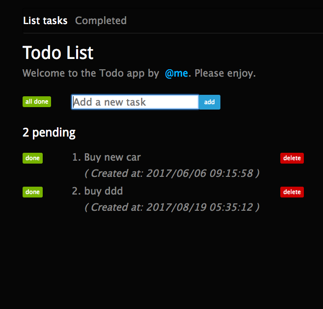

# Todo app with Express.js

> This project is based on [github.com/azat-co/todo-express](http://github.com/azat-co/todo-express).

This is an example of create, read, update, delete web application built with Express.js v4.8.1, and different ways of persisting data (memory variables, session, cookie, files, mongoDB... )

<!--  -->

## Versions of the App

- **tag [v1.0](https://github.com/juanmaguitar/todo-express/tree/v1.0)** - Tasks stored in memory
- **tag [v0.2.1](https://github.com/juanmaguitar/todo-express/tree/v0.2.1)** - Tasks stored in DB. Using [`mongoskin`](https://www.npmjs.com/package/mongoskin) (kind of mongoose)

- **branch [azat-co-todo](https://github.com/juanmaguitar/todo-express/tree/)** - Tasks stored in DB. Using [`mongodb`](https://www.npmjs.com/package/mongodb) (Official MongDB driver)

- **branch [mongo-raw](https://github.com/juanmaguitar/todo-express/tree/mongo-raw)** - Tasks stored in DB. Using [`mongodb`](https://www.npmjs.com/package/mongodb) (Official MongDB driver)

## More info
More Express.js in [Pro Express.js](http://proexpressjs.com).  
More Node.js frameworks at [nodeframework.com](http://nodeframework.com).
